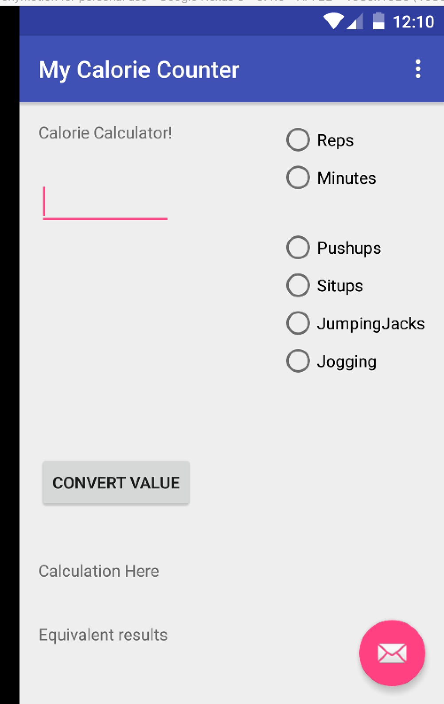
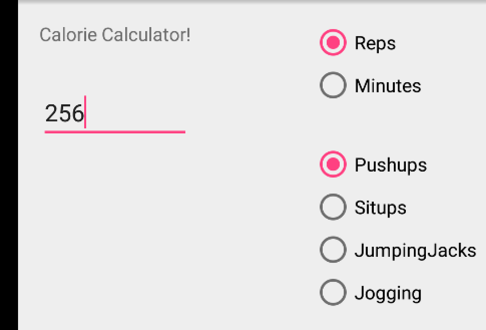
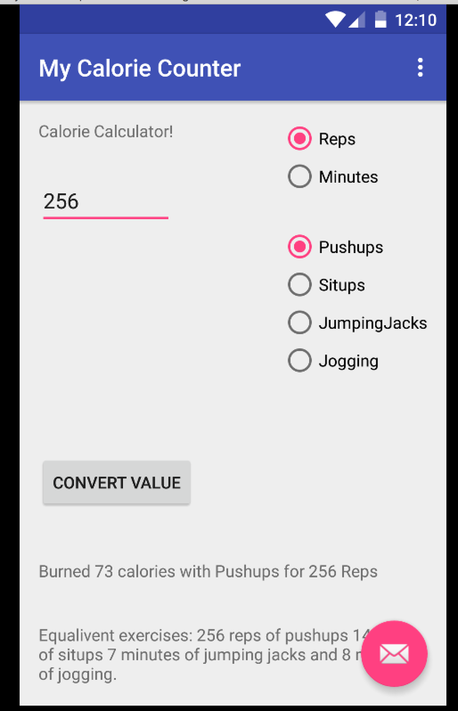

# PROG 01: Crunch Time

Title : What Exercise Shall I Do Today? 

Basic calorie calcation android app. Enter your numeric data, select reps or minutes as the metric, and select your activity. Displays the calories burned if the correct combination (metric - activity) is used, and displays the equivalent effort from other activities needed to be done to achieve the same level of calories burned.

Simply input a numeric value (words are not accepted), and select "Reps" or "Minutes" as your metric of measurement. Ensure that activity and metric type match up, (pushups + reps, jogging + minutes) for a correct calculation to appear.

Select the activity and hit the calculate button. Your results will show up in the two text fields below the button.

## Authors

Owen Chen owenchen@berkeley.edu

## Demo Video

https://www.youtube.com/watch?v=NtgH-fPpJ38&feature=youtu.be

## Screenshots

## Acknowledgments

* Hat tip to anyone who's code was used
* Any other support

*Feel free to enhance your README. For Markdown syntax, see [the GitHub Guides](https://guides.github.com/features/mastering-markdown/). Remove this line in your submission.*
